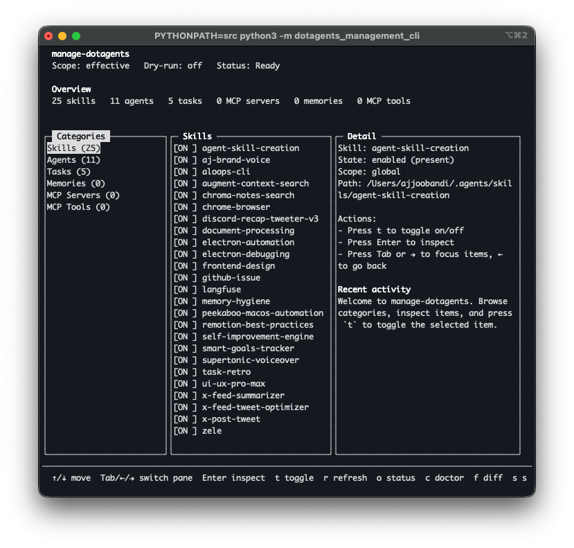

# manage-dotagents

Interactive terminal UI for managing `.agents` resources across global, workspace, and effective scopes.

## What it does

- shows a high-level overview on first load
- lets you browse skills, agents, tasks, memories, MCP servers, and MCP tools
- supports drilling into individual items
- lets you toggle supported items on/off from the TUI
- supports `global`, `workspace`, and `effective` scope views
- includes doctor, diff, backup, and config-editing command support underneath the UI

## Run it

### Local dev

- `PYTHONPATH=src python3 -m dotagents_management_cli`

### Installed CLI

- `manage-dotagents`

## TUI controls

- `↑/↓` or `j/k` — move
- `Tab` / `→` — move into items
- `←` — go back to categories
- `Enter` — inspect selected item
- `t` — toggle selected item on/off
- `g` / `w` / `e` — set scope
- `s` — cycle scope
- `d` — toggle dry-run
- `r` — refresh
- `o` — status
- `c` — doctor
- `f` — diff
- `q` — quit

## Project layout

- `src/dotagents_management_cli/cli.py` — CLI and TUI implementation
- `tests/test_cli.py` — unit coverage for CLI and TUI helpers
- `docs/dotagents-management-cli-prd.md` — original product requirements